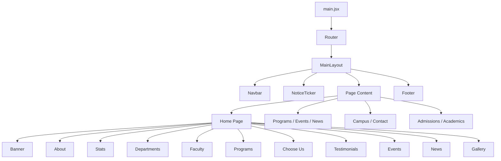

# Modern University

A modern, fully responsive university website built with **React**, **Tailwind CSS**, and **Vite**. Designed to deliver a fast, professional, and interactive experience — from the hero slider to dedicated admissions and academics pages.


---

## Table of Contents

- [Overview](#overview)
- [Architecture](#architecture)
- [Home Page Sections](#home-page-sections)
- [Global UI Components](#global-ui-components)
- [Routes & Pages](#routes--pages)
- [Project Structure](#project-structure)
- [Tech Stack](#tech-stack)
- [Getting Started](#getting-started)
- [Design System](#design-system)
- [Search](#search)
- [Customization](#customization)
- [License](#license)

---

## Overview

**Modern University** is a complete frontend university portal featuring:

- Academic programs and departments
- Faculty profiles and student testimonials
- Events, news, and campus gallery
- Full admissions and academics information
- Live site-wide search

All sections work together under a shared layout. The navbar, notice ticker, and footer are consistent across every page, while the home page consolidates all primary content sections in one scrollable experience.

---

## Architecture



| Layer | Responsibility |
|-------|----------------|
| `MainLayout` | Wraps every page with Navbar, Notice Ticker, and Footer |
| `router.jsx` | Defines all application routes |
| `data/` | Centralized content for programs, news, events, and search |
| `pages/` | Standalone full-page views |
| `components/` | Reusable UI blocks and home page sections |

---

## Home Page Sections

| # | Section | Component | Description |
|---|---------|-----------|-------------|
| 1 | Hero Banner | `Banner.jsx` | Full-screen Swiper slider with 3 campus images and linked CTA buttons |
| 2 | About | `About.jsx` | Dark-themed section with embedded video and university introduction |
| 3 | Statistics | `StatsSection.jsx` | Four animated counters triggered on scroll via IntersectionObserver |
| 4 | Departments | `DepartmentsSection.jsx` | Six department cards: CSE, EEE, BBA, Law, English, Architecture |
| 5 | Faculty | `FacultyShowcase.jsx` | Auto-playing faculty carousel with social media links |
| 6 | Programs | `OurProgram.jsx` | Three featured program cards with link to full program listing |
| 7 | Why Choose Us | `ChooseUs.jsx` | Key statistics, highlights, and campus imagery |
| 8 | Testimonials | `TestimonialSection.jsx` | Student reviews with star ratings, Swiper slider, and AOS animations |
| 9 | Events | `Events.jsx` | Four upcoming events with link to the full event calendar |
| 10 | Latest News | `LatestNews.jsx` | Three news cards with link to all news posts |
| 11 | Campus Gallery | `ImgBar.jsx` | Responsive image gallery with lightbox modal |

---

## Global UI Components

### Navbar (`src/shared/Navbar.jsx`)

- Transparent on the home hero; transitions to a white background with shadow on scroll
- Mega dropdown menus for **Academics** and **Admissions** with fully functional links
- Animated hamburger menu for mobile navigation
- Live search across programs, news, events, and all menu pages
- **Apply Now** button routes to `/admissions/apply`
- Solid white navbar on all non-home pages for consistent readability

### Notice Ticker (`src/shared/NoticeTicker.jsx`)

- Fixed position directly below the navbar
- Red **Notice** badge with auto-scrolling announcement text
- Pauses animation when outside the viewport to optimize performance

### Footer (`src/shared/Footer.jsx`)

- Brand information, quick links, academics, and admissions navigation
- Newsletter subscription form
- Social media icons and copyright notice

---

## Routes & Pages

| Route | Page | Description |
|-------|------|-------------|
| `/` | Home | All main content sections |
| `/programs` | All Programs | Nine programs with category filtering |
| `/programs/:slug` | Academic Page | Undergraduate, Graduate, Doctoral, Online Learning |
| `/faculties/:slug` | Academic Page | Engineering, Business, Arts & Sciences, Medicine |
| `/academics/:slug` | Academic Page | Calendar, Library, Research Centers, Student Support |
| `/events` | Event Calendar | Six events with month-based filtering |
| `/news` | All News | Six news articles with category filtering |
| `/campus` | Campus | Facilities overview, gallery, and visit CTA |
| `/contacts` | Contact | Contact details and inquiry form |
| `/admissions/:slug` | Admission Page | Apply, Requirements, Deadlines, and more |
| `/scholarships` | Admission Page | Scholarship programs and eligibility |

### Admissions Routes

`apply` · `requirements` · `deadlines` · `transfer` · `tuition` · `scholarships` · `financial-aid` · `payment` · `open-days` · `international` · `campus` · `contacts`

### Academics Routes

`undergraduate` · `graduate` · `doctoral` · `online` · `engineering` · `business` · `arts` · `medicine` · `calendar` · `library` · `research` · `support`

Each admissions and academics page includes a sidebar for easy navigation between related sections.

---

## Project Structure

```
Modern-University/
├── public/
│   └── images/
│       ├── banner/              # Hero slider images
│       └── programs/            # Program card images
├── src/
│   ├── components/
│   │   ├── Banner.jsx
│   │   ├── Home.jsx
│   │   ├── ProgramCard.jsx
│   │   ├── EventCard.jsx
│   │   ├── NewsCard.jsx
│   │   └── HomeComponents/      # Home page section components
│   ├── data/
│   │   ├── programs.js
│   │   ├── events.js
│   │   ├── news.js
│   │   ├── admissionsContent.js
│   │   ├── academicsContent.js
│   │   └── searchIndex.js       # Global search index
│   ├── hooks/
│   │   └── useInView.js         # Viewport visibility hook
│   ├── layout/
│   │   └── MainLayout.jsx
│   ├── pages/                   # Standalone page views
│   ├── router/
│   │   └── router.jsx
│   └── shared/
│       ├── Navbar.jsx
│       ├── Footer.jsx
│       └── NoticeTicker.jsx
├── index.html
├── tailwind.config.js
└── vite.config.js
```

---

## Tech Stack

| Feature | Library |
|---------|---------|
| UI Framework | React 18 |
| Build Tool | Vite 6 |
| Styling | Tailwind CSS 3 + DaisyUI |
| Routing | React Router DOM v7 |
| Sliders / Carousels | Swiper.js 11 |
| Scroll Animations | AOS |
| Animated Counters | react-countup |
| Notice Marquee | react-fast-marquee |
| Icons | Lucide React, React Icons |
| Performance | Lazy loading, IntersectionObserver, local image assets |

---

## Getting Started

### Prerequisites

- Node.js 18 or higher
- npm or yarn

### Installation

```bash
git clone https://github.com/your-username/Modern-University.git
cd Modern-University
npm install
npm run dev
```

Open [http://localhost:5173](http://localhost:5173) in your browser.

### Production Build

```bash
npm run build
npm run preview
```

### Linting

```bash
npm run lint
```

---

## Design System

| Token | Value |
|-------|-------|
| Primary Color | Emerald (`emerald-600`) |
| Dark Background | `slate-900` |
| Light Background | `gray-50` / `white` |
| Typography | Serif (default layout font) |
| Card Radius | `rounded-2xl` |
| Interactions | Lift, shadow, and image scale on hover |

---

## Search

The navbar search bar provides live results across the entire site, including:

- All programs, news articles, and events
- Every admissions and academics menu item
- Campus, contact, and application pages

Results appear as the user types. Press **Enter** to navigate to the first result, or **Escape** to close the search panel.

---

## Customization

| Content | File |
|---------|------|
| Programs | `src/data/programs.js` |
| News articles | `src/data/news.js` |
| Events | `src/data/events.js` |
| Admissions pages | `src/data/admissionsContent.js` |
| Academics pages | `src/data/academicsContent.js` |
| Notice announcements | `src/shared/NoticeTicker.jsx` |
| Banner slides | `src/components/Banner.jsx` |
| Application routes | `src/router/router.jsx` |

### Banner CTA Links

| Slide | Primary Button | Destination |
|-------|---------------|-------------|
| 1 | Sign Up for Excursion | `/admissions/open-days` |
| 1 | Learn More | `/campus` |
| 2 | Visit Now | `/campus` |
| 2 | Get Started | `/admissions/apply` |
| 3 | View Programs | `/programs` |
| 3 | Apply Now | `/admissions/apply` |

---

## Developer

**MD Nasir Uddin**  
Frontend Developer — Modern University Project

---

## License

This project is intended for educational purposes.

---

<p align="center">
  <strong>Modern University</strong> — Shaping Future Leaders Since 1992
</p>
